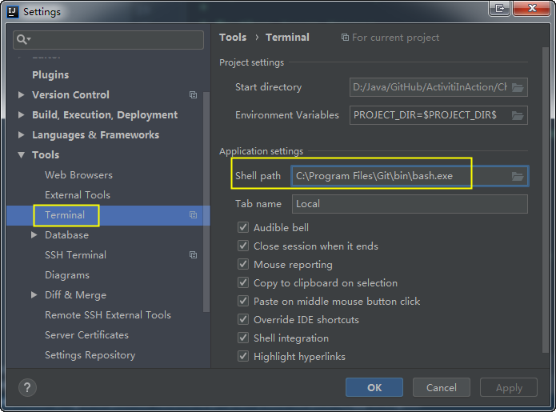
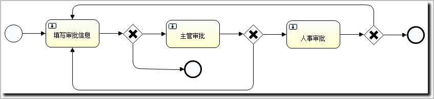
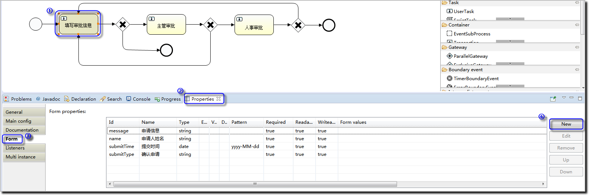
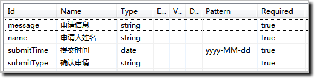
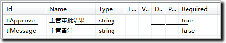
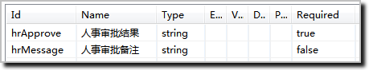

## 第3章 Activiti6.0源码初探
### 3-1  本章概述
### 3-2  Activiti6.0源码初探-概览与获取
### 3-3  Activiti6.0源码初探-engine
### 3-4  Activiti6.0源码初探-模块介绍
### 3-5  Activiti6.0源码初探-activiti-app运行
- 设置IDEA控制台：                                                                                                                                                                                         

- 在控制台执行命令：
```
D:\Java\GitHub\Activiti6>cd modules/activiti-ui/activiti-app
D:\Java\GitHub\Activiti6\modules\activiti-ui\activiti-app>mvn clean tomcat7:run
```
- 执行结果：
```
$ mvn clean tomcat7:run
[INFO] Scanning for projects...
[INFO] ------------------------------------------------------------------------
[INFO] Building activiti-app 6.0.0
[INFO] ------------------------------------------------------------------------
...
[INFO] --- tomcat7-maven-plugin:2.2:run (default-cli) @ activiti-app ---
[INFO] Running war on http://localhost:9999/activiti-app
...
一月 10, 2019 11:34:30 上午 org.apache.catalina.core.ApplicationContext log
信息: Initializing Spring FrameworkServlet 'apiDispatcher'
一月 10, 2019 11:34:33 上午 org.apache.catalina.core.ApplicationContext log
信息: Initializing Spring FrameworkServlet 'appDispatcher'
一月 10, 2019 11:34:33 上午 org.apache.coyote.AbstractProtocol start
信息: Starting ProtocolHandler ["http-nio-9999"]
```
### 3-6  Activiti6.0源码初探-WebConfigurer
### 3-7  Activiti6.0源码初探-helloword-1

- 完整流程图：                                                                                                                                                                                                                 


- 参考下图新增表单数据（注意类型、模式和是否必填）：                                                                                                                                                                                                                 


- 【填写审批信息】表单数据：                                                                                                                                                                                                                 


- 【主管审批】表单数据：                                                                                                                                                                                                                 


- 【人事审批】表单数据：                                                                                                                                                                                                                 



### 3-8  Activiti6.0源码初探-helloword-2

- 代码清单：pom.xml
```xml
<?xml version="1.0" encoding="UTF-8"?>
<project xmlns="http://maven.apache.org/POM/4.0.0"
         xmlns:xsi="http://www.w3.org/2001/XMLSchema-instance"
         xsi:schemaLocation="http://maven.apache.org/POM/4.0.0
         http://maven.apache.org/xsd/maven-4.0.0.xsd">
    <modelVersion>4.0.0</modelVersion>

    <groupId>com.coderdream.activiti</groupId>
    <artifactId>activiti6-helloworld</artifactId>
    <version>1.0-SNAPSHOT</version>

    <dependencies>
        <dependency>
            <groupId>org.activiti</groupId>
            <artifactId>activiti-engine</artifactId>
            <version>6.0.0</version>
        </dependency>
        <dependency>
            <groupId>junit</groupId>
            <artifactId>junit</artifactId>
            <version>4.12</version>
            <scope>test</scope>
        </dependency>
        <dependency>
            <groupId>ch.qos.logback</groupId>
            <artifactId>logback-classic</artifactId>
            <version>1.1.11</version>
        </dependency>
        <dependency>
            <groupId>com.google.guava</groupId>
            <artifactId>guava</artifactId>
            <version>23.0</version>
        </dependency>
        <dependency>
            <groupId>com.h2database</groupId>
            <artifactId>h2</artifactId>
            <version>1.4.193</version>
        </dependency>
    </dependencies>

</project>
```

### 3-9  Activiti6.0源码初探-helloword_idea-1


1. 先梳理流程

- 代码清单：DemoMain.java
```java
public class DemoMain {

    private static final Logger LOGGER = LoggerFactory.getLogger(DemoMain.class);

    public static void main(String[] args) {
        LOGGER.info("启动我们的程序");
        // 创建流程引擎
        // 部署流程定义文件
        // 启动运行流程
        // 处理流程任务
        LOGGER.info("结束我们的程序");
    }

}
```
1. 配置log，只打印简易信息：

- 代码清单：logback.xml
```xml
<?xml version="1.0" encoding="UTF-8"?>
<configuration debug="false" scan="true" scanPeriod="30 seconds">
    <property name="log.dir" value="target/logs"/>
    <property name="encoding" value="UTF-8"/>
    <property name="plain" value="%msg%n"/>
    <property name="std" value="%d{HH:mm:ss.SSS}[%thread][%-5level]%msg %X{user} %logger{10}.%M:%L%n"/>
    <property name="normal" value="%d{yyyy-MM-dd:HH:mm:ss.SSS}[%thread][%-5level] %logger{10}.%M:%L  %msg%n"/>
    <!-- 控制台输出 -->
    <appender name="stdout" class="ch.qos.logback.core.ConsoleAppender">
        <encoder>
            <pattern>${plain}</pattern>
            <charset>${encoding}</charset>
        </encoder>
    </appender>

    <!-- 时间滚动输出 level为 ALL 日志 -->
    <appender name="file"
              class="ch.qos.logback.core.rolling.RollingFileAppender">
        <File>${log.dir}/file.log</File>
        <rollingPolicy class="ch.qos.logback.core.rolling.TimeBasedRollingPolicy">
            <FileNamePattern>${log.dir}/file.%d{yyyy-MM-dd}.log</FileNamePattern>
            <MaxHistory>30</MaxHistory>
        </rollingPolicy>
        <encoder>
            <pattern>${std}</pattern>
            <charset>${encoding}</charset>
        </encoder>
    </appender>
    <logger name="root">
        <level value="ERROR"/>
    </logger>
    <logger name="com.coderdream">
        <level value="DEBUG"/>
    </logger>
    <root>
        <appender-ref ref="stdout"/>
        <appender-ref ref="file"/>
    </root>
</configuration>
```


- 完整流程代码
```java
LOGGER.info("启动我们的程序");
// 创建流程引擎
ProcessEngineConfiguration cfg = ProcessEngineConfiguration.createStandaloneInMemProcessEngineConfiguration();
ProcessEngine processEngine = cfg.buildProcessEngine();
String name = processEngine.getName();
String version = ProcessEngine.VERSION;
LOGGER.info("流程引擎名称{}，版本{}", name, version);
// 部署流程定义文件
RepositoryService repositoryService = processEngine.getRepositoryService();
DeploymentBuilder deploymentBuilder = repositoryService.createDeployment();
deploymentBuilder.addClasspathResource("second_approve.bpmn");
Deployment deployment = deploymentBuilder.deploy();
String deploymentId = deployment.getId();
ProcessDefinition processDefinition = repositoryService
        .createProcessDefinitionQuery()
        .deploymentId(deploymentId)
        .singleResult();
LOGGER.info("流程定义文件 [{}]，流程ID [{}]", processDefinition.getName(), processDefinition.getId());
// 启动运行流程
RuntimeService runtimeService = processEngine.getRuntimeService();
ProcessInstance processInstance = runtimeService.startProcessInstanceById(processDefinition.getId());
LOGGER.info("启动流程 [{}]", processInstance.getProcessDefinitionKey());
// 处理流程任务
TaskService taskService = processEngine.getTaskService();
List<Task> list = taskService.createTaskQuery().list();
for (Task task : list) {
    LOGGER.info("待处理任务 [{}]", task.getName());
}
LOGGER.info("待处理任务数量 [{}]", list.size());
LOGGER.info("结束我们的程序");
```
- 运行结果：
```
启动我们的程序
流程引擎名称default，版本6.0.0.4
流程定义文件 [二级审批]，流程ID [second_approve:1:4]
启动流程 [second_approve]
待处理任务 [填写审批信息]
待处理任务数量 [1]
结束我们的程序
```


### 3-10  Activiti6.0源码初探-helloword_idea-2
### 3-11  Activiti6.0源码初探-helloword_idea-3