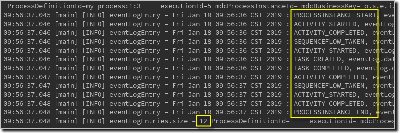
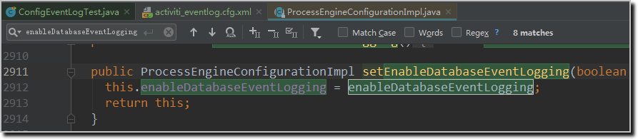
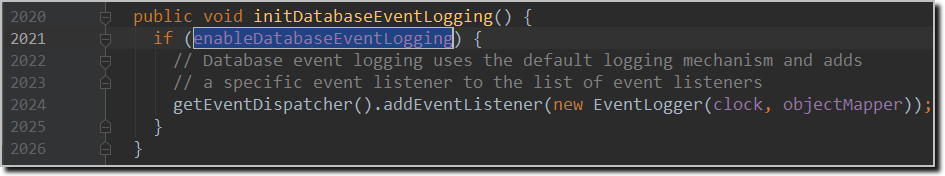
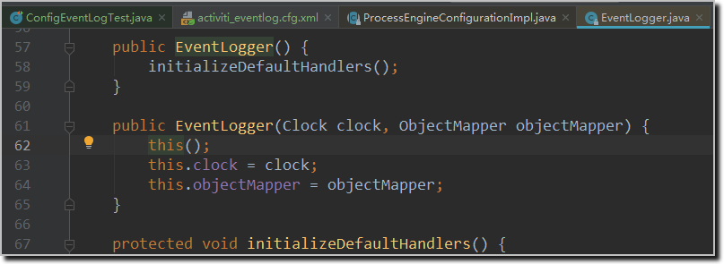
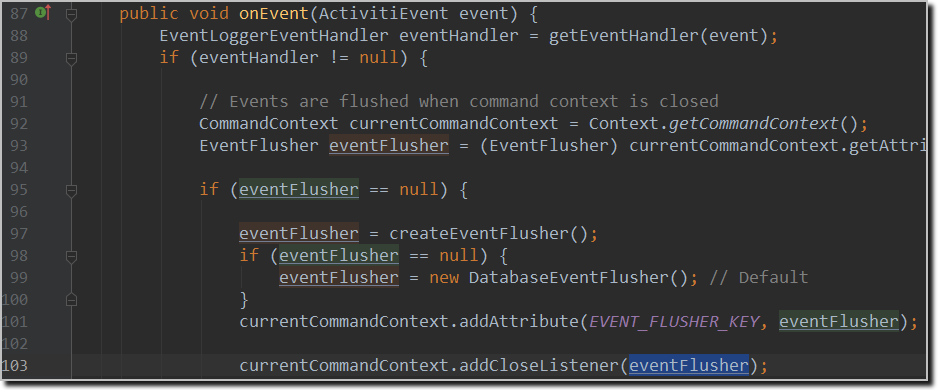
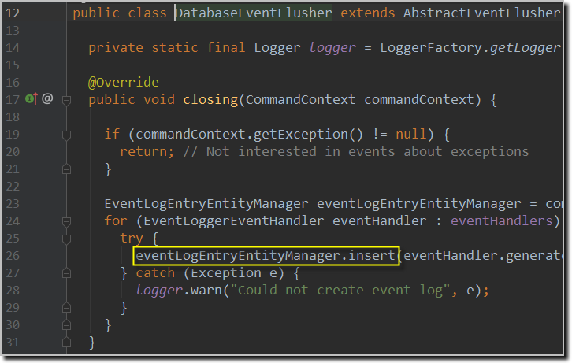

## 4-10  事件处理及监听器配置-eventlog

### 最佳实践

1. 新建配置文件activiti_eventlog.cfg.xml，设置 enableDatabaseEventLogging 为 true；
2. 新增测试类 ConfigEventLogTest，打印事件日志

- 代码清单1：activiti_eventlog.cfg.xml
```xml
<?xml version="1.0" encoding="UTF-8"?>
<beans xmlns="http://www.springframework.org/schema/beans" 
       xmlns:xsi="http://www.w3.org/2001/XMLSchema-instance"
       xsi:schemaLocation="http://www.springframework.org/schema/beans
       http://www.springframework.org/schema/beans/spring-beans.xsd">

  <bean id="processEngineConfiguration" 
	class="org.activiti.engine.impl.cfg.StandaloneInMemProcessEngineConfiguration">
    <property name="commandInvoker" ref="commandInvoker" />
    <property name="enableDatabaseEventLogging" value="true" />
  </bean>

  <bean id="commandInvoker" class="com.coderdream.interceptor.MDCCommandInvoker" />

</beans>
```

- 代码清单2：ConfigEventLogTest.java
```java
@Rule
public ActivitiRule activitiRule = new ActivitiRule("activiti_eventlog.cfg.xml");

@Test
@Deployment(resources = {"my-process.bpmn20.xml"})
public void test() {
    ProcessInstance processInstance = activitiRule.getRuntimeService()
            .startProcessInstanceByKey("my-process");

    Task task = activitiRule.getTaskService().createTaskQuery().singleResult();

    // 继续执行流程
    activitiRule.getTaskService().complete(task.getId());


    List<EventLogEntry> eventLogEntries = activitiRule.getManagementService()
            .getEventLogEntriesByProcessInstanceId(processInstance.getProcessInstanceId());
    for (EventLogEntry eventLogEntry : eventLogEntries) {
        LOGGER.info("eventLogEntry = {}, eventLog.data = {}", eventLogEntry, new String(eventLogEntry.getData()));
    }
    LOGGER.info("eventLogEntries.size = {}", eventLogEntries.size());
}
```

- 结果分析（12条记录）：


- 完整运行结果：
```
09:56:37.045 [main] [INFO] eventLogEntry = Fri Jan 18 09:56:36 CST 2019 : PROCESSINSTANCE_START, eventLog.data = {"timeStamp":1547776596844,"processDefinitionId":"my-process:1:3","createTime":1547776596844,"id":"4"} ProcessDefinitionId=     executionId= mdcProcessInstanceId= mdcBusinessKey= c.c.c.ConfigEventLogTest.test:42
09:56:37.046 [main] [INFO] eventLogEntry = Fri Jan 18 09:56:36 CST 2019 : ACTIVITY_STARTED, eventLog.data = {"timeStamp":1547776596851,"activityId":"start","processDefinitionId":"my-process:1:3","processInstanceId":"4","executionId":"5","behaviorClass":"org.activiti.engine.impl.bpmn.behavior.NoneStartEventActivityBehavior","activityType":"startEvent"} ProcessDefinitionId=     executionId= mdcProcessInstanceId= mdcBusinessKey= c.c.c.ConfigEventLogTest.test:42
09:56:37.046 [main] [INFO] eventLogEntry = Fri Jan 18 09:56:36 CST 2019 : ACTIVITY_COMPLETED, eventLog.data = {"timeStamp":1547776596853,"activityId":"start","processDefinitionId":"my-process:1:3","processInstanceId":"4","executionId":"5","behaviorClass":"org.activiti.engine.impl.bpmn.behavior.NoneStartEventActivityBehavior","activityType":"startEvent"} ProcessDefinitionId=     executionId= mdcProcessInstanceId= mdcBusinessKey= c.c.c.ConfigEventLogTest.test:42
09:56:37.046 [main] [INFO] eventLogEntry = Fri Jan 18 09:56:36 CST 2019 : SEQUENCEFLOW_TAKEN, eventLog.data = {"targetActivityId":"someTask","timeStamp":1547776596856,"targetActivityBehaviorClass":"org.activiti.engine.impl.bpmn.behavior.UserTaskActivityBehavior","sourceActivityType":"org.activiti.bpmn.model.StartEvent","targetActivityName":"Activiti is awesome!","id":"flow1","sourceActivityBehaviorClass":"org.activiti.engine.impl.bpmn.behavior.NoneStartEventActivityBehavior","targetActivityType":"org.activiti.bpmn.model.UserTask","sourceActivityId":"start"} ProcessDefinitionId=     executionId= mdcProcessInstanceId= mdcBusinessKey= c.c.c.ConfigEventLogTest.test:42
09:56:37.046 [main] [INFO] eventLogEntry = Fri Jan 18 09:56:36 CST 2019 : ACTIVITY_STARTED, eventLog.data = {"timeStamp":1547776596858,"activityId":"someTask","processDefinitionId":"my-process:1:3","processInstanceId":"4","executionId":"5","behaviorClass":"org.activiti.engine.impl.bpmn.behavior.UserTaskActivityBehavior","activityName":"Activiti is awesome!","activityType":"userTask"} ProcessDefinitionId=     executionId= mdcProcessInstanceId= mdcBusinessKey= c.c.c.ConfigEventLogTest.test:42
09:56:37.046 [main] [INFO] eventLogEntry = Fri Jan 18 09:56:36 CST 2019 : TASK_CREATED, eventLog.data = {"timeStamp":1547776596873,"taskDefinitionKey":"someTask","processDefinitionId":"my-process:1:3","processInstanceId":"4","executionId":"5","createTime":1547776596858,"name":"Activiti is awesome!","id":"8","priority":50} ProcessDefinitionId=     executionId= mdcProcessInstanceId= mdcBusinessKey= c.c.c.ConfigEventLogTest.test:42
09:56:37.047 [main] [INFO] eventLogEntry = Fri Jan 18 09:56:36 CST 2019 : TASK_COMPLETED, eventLog.data = {"duration":141,"timeStamp":1547776596999,"taskDefinitionKey":"someTask","processDefinitionId":"my-process:1:3","processInstanceId":"4","executionId":"5","createTime":1547776596858,"name":"Activiti is awesome!","id":"8","priority":50} ProcessDefinitionId=     executionId= mdcProcessInstanceId= mdcBusinessKey= c.c.c.ConfigEventLogTest.test:42
09:56:37.047 [main] [INFO] eventLogEntry = Fri Jan 18 09:56:37 CST 2019 : ACTIVITY_COMPLETED, eventLog.data = {"timeStamp":1547776597011,"activityId":"someTask","processDefinitionId":"my-process:1:3","processInstanceId":"4","executionId":"5","behaviorClass":"org.activiti.engine.impl.bpmn.behavior.UserTaskActivityBehavior","activityName":"Activiti is awesome!","activityType":"userTask"} ProcessDefinitionId=     executionId= mdcProcessInstanceId= mdcBusinessKey= c.c.c.ConfigEventLogTest.test:42
09:56:37.047 [main] [INFO] eventLogEntry = Fri Jan 18 09:56:37 CST 2019 : SEQUENCEFLOW_TAKEN, eventLog.data = {"targetActivityId":"end","timeStamp":1547776597012,"sourceActivityName":"Activiti is awesome!","targetActivityBehaviorClass":"org.activiti.engine.impl.bpmn.behavior.NoneEndEventActivityBehavior","sourceActivityType":"org.activiti.bpmn.model.UserTask","id":"flow2","sourceActivityBehaviorClass":"org.activiti.engine.impl.bpmn.behavior.UserTaskActivityBehavior","targetActivityType":"org.activiti.bpmn.model.EndEvent","sourceActivityId":"someTask"} ProcessDefinitionId=     executionId= mdcProcessInstanceId= mdcBusinessKey= c.c.c.ConfigEventLogTest.test:42
09:56:37.048 [main] [INFO] eventLogEntry = Fri Jan 18 09:56:37 CST 2019 : ACTIVITY_STARTED, eventLog.data = {"timeStamp":1547776597013,"activityId":"end","processDefinitionId":"my-process:1:3","processInstanceId":"4","executionId":"5","behaviorClass":"org.activiti.engine.impl.bpmn.behavior.NoneEndEventActivityBehavior","activityType":"endEvent"} ProcessDefinitionId=     executionId= mdcProcessInstanceId= mdcBusinessKey= c.c.c.ConfigEventLogTest.test:42
09:56:37.048 [main] [INFO] eventLogEntry = Fri Jan 18 09:56:37 CST 2019 : ACTIVITY_COMPLETED, eventLog.data = {"timeStamp":1547776597013,"activityId":"end","processDefinitionId":"my-process:1:3","processInstanceId":"4","executionId":"5","behaviorClass":"org.activiti.engine.impl.bpmn.behavior.NoneEndEventActivityBehavior","activityType":"endEvent"} ProcessDefinitionId=     executionId= mdcProcessInstanceId= mdcBusinessKey= c.c.c.ConfigEventLogTest.test:42
09:56:37.048 [main] [INFO] eventLogEntry = Fri Jan 18 09:56:37 CST 2019 : PROCESSINSTANCE_END, eventLog.data = {"timeStamp":1547776597028,"processDefinitionId":"my-process:1:3","id":"4","endTime":1547776597028} ProcessDefinitionId=     executionId= mdcProcessInstanceId= mdcBusinessKey= c.c.c.ConfigEventLogTest.test:42
09:56:37.048 [main] [INFO] eventLogEntries.size = 12 ProcessDefinitionId=     executionId= mdcProcessInstanceId= mdcBusinessKey= c.c.c.ConfigEventLogTest.test:44

Process finished with exit code 0
```

### 代码分析

1. 在 ProcessEngineConfigurationImpl 的 setEnableDatabaseEventLogging 进行设置


2. 如果设置为true，则在 initDatabaseEventLogging 方法中会新建一个 EventLogger 对象


3. EventLogger 的初始化动作


4. EventLogger 会新增 EventFlusher（DatabaseEventFlusher） 对象到 Close 监听器


5. 在 DatabaseEventFlusher 的 close 方法中将记录插入数据库

