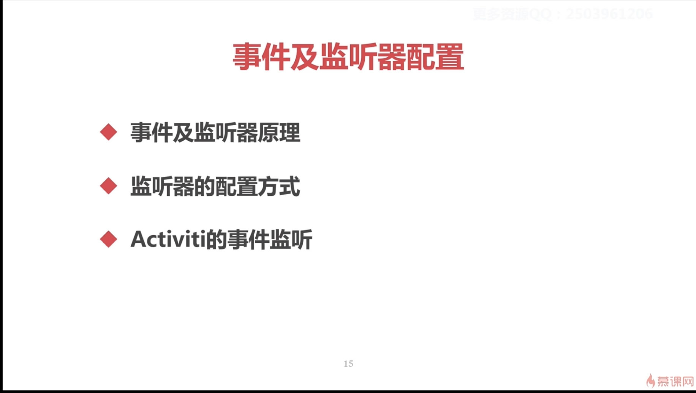
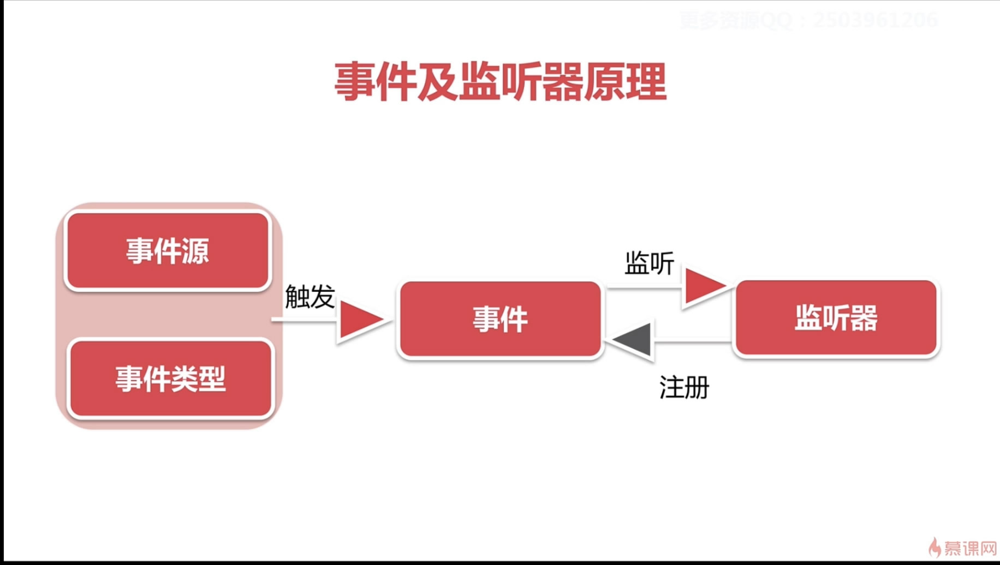
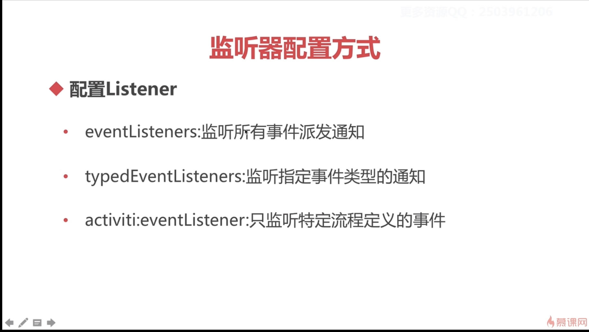
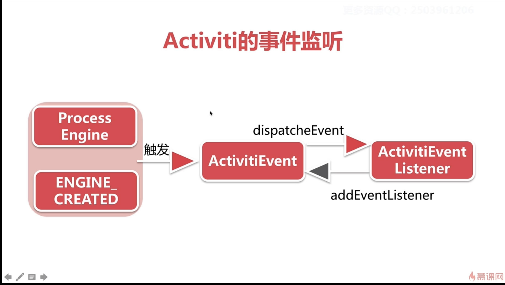
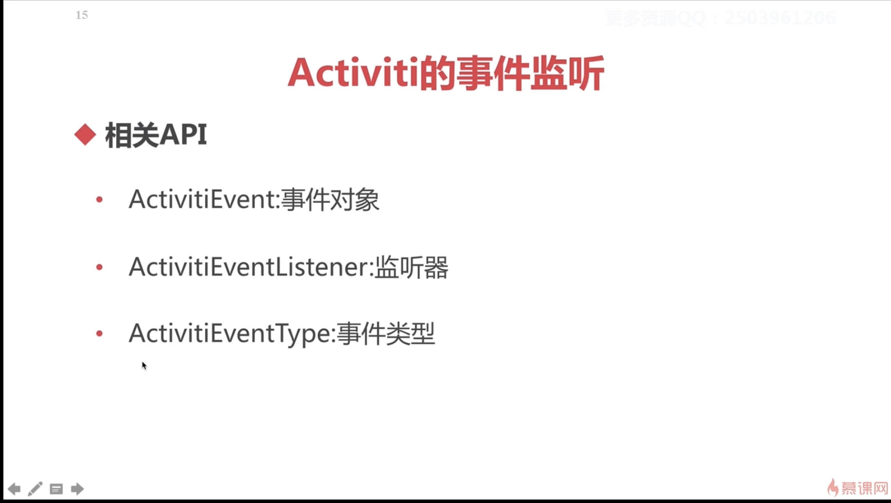
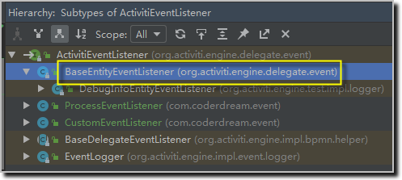
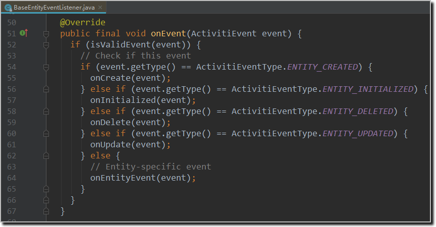
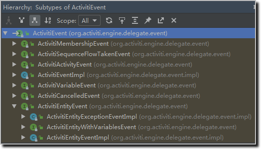
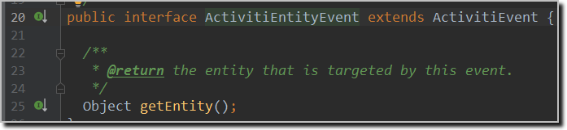
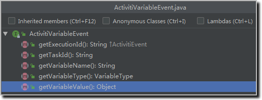

## 4-12 事件处理及监听器配置-eventLinstener


###

- 主要内容

- 事件及监听器原理

- 监听器配置方式

- Activiti事件监听

- 相关API


## 最佳实践

1. 新建流程事件监听器 ProcessEventListener 和自定义事件监听器 CustomEventListener
2. 新建配置文件 activiti_eventListener.cfg.xml，设置监听类；
3. 新增测试类 ConfigEventListenerTest，查看执行结果

### 情形一：配置监听类

- 代码清单1：activiti_eventListener.cfg.xml
```xml
<?xml version="1.0" encoding="UTF-8"?>
<beans xmlns="http://www.springframework.org/schema/beans" 
       xmlns:xsi="http://www.w3.org/2001/XMLSchema-instance"
       xsi:schemaLocation="http://www.springframework.org/schema/beans
       http://www.springframework.org/schema/beans/spring-beans.xsd">

  <bean id="processEngineConfiguration" 
	class="org.activiti.engine.impl.cfg.StandaloneInMemProcessEngineConfiguration">
        <!--指定监听类-->
        <property name="eventListeners">
            <list>
                <bean class="com.coderdream.event.ProcessEventListener"/>
            </list>
        </property>
  </bean>

  <bean id="commandInvoker" class="com.coderdream.interceptor.MDCCommandInvoker" />

</beans>
```

- 代码清单2：ConfigEventListenerTest.java
```java
public class ConfigEventListenerTest {

    /** logger */
    private static final Logger LOGGER = LoggerFactory.getLogger(ConfigEventListenerTest.class);

    @Rule
    public ActivitiRule activitiRule = new ActivitiRule("activiti_eventListener.cfg.xml");

    @Test
    @Deployment(resources = {"my-process.bpmn20.xml"})
    public void test() {
        ProcessInstance processInstance = activitiRule.getRuntimeService()
                .startProcessInstanceByKey("my-process");
        Task task = activitiRule.getTaskService().createTaskQuery().singleResult();
        // 继续执行流程
        activitiRule.getTaskService().complete(task.getId());
    }

}
```

- 运行结果：
```
14:26:36.770 [main] [INFO] 流程启动 PROCESS_STARTED 	 4 ProcessDefinitionId=     executionId= mdcProcessInstanceId= mdcBusinessKey= c.c.e.ProcessEventListener.onEvent:19
14:26:36.966 [main] [INFO] 流程结束 PROCESS_COMPLETED 	 4 ProcessDefinitionId=     executionId= mdcProcessInstanceId= mdcBusinessKey= c.c.e.ProcessEventListener.onEvent:21
```

### 情形二：配置特定监听类型

```xml
<!--定义监听类型-->
<property name="typedEventListeners">
    <map>
        <entry key="PROCESS_STARTED">
            <list>
                <bean class="com.coderdream.event.ProcessEventListener"/>
            </list>
        </entry>
    </map>
</property>
```

- 运行结果：
```
14:29:41.461 [main] [INFO] ProcessEngine default created ProcessDefinitionId=     executionId= mdcProcessInstanceId= mdcBusinessKey= o.a.e.i.ProcessEngineImpl.<init>:87
14:29:41.661 [main] [INFO] 流程启动 PROCESS_STARTED 	 4 ProcessDefinitionId=     executionId= mdcProcessInstanceId= mdcBusinessKey= c.c.e.ProcessEventListener.onEvent:19

```
### 情形三：配置自定义监听

```xml
<!--自定义监听-->
<property name="eventListeners">
    <list>
        <bean class="com.coderdream.event.CustomEventListener"/>
    </list>
</property>
```

- 运行结果
```
14:35:17.609 [main] [INFO] ProcessEngine default created ProcessDefinitionId=     executionId= mdcProcessInstanceId= mdcBusinessKey= o.a.e.i.ProcessEngineImpl.<init>:87
14:35:17.928 [main] [INFO] 监听到自定义事件 CUSTOM 	 null ProcessDefinitionId=     executionId= mdcProcessInstanceId= mdcBusinessKey= c.c.e.CustomEventListener.onEvent:19

Process finished with exit code 0
```

### 情形四：在源代码中配置自定义监听

- 代码清单：
```java
@Test
@Deployment(resources = {"my-process.bpmn20.xml"})
public void test() {
    ProcessInstance processInstance = activitiRule.getRuntimeService()
            .startProcessInstanceByKey("my-process");
    Task task = activitiRule.getTaskService().createTaskQuery().singleResult();
    // 继续执行流程
    activitiRule.getTaskService().complete(task.getId());
    // 通过代码添加监听器（非配置文件方式）
    activitiRule.getRuntimeService().addEventListener(new CustomEventListener());
    // 添加一个自定义事件
    activitiRule.getRuntimeService().dispatchEvent(new ActivitiEventImpl(ActivitiEventType.CUSTOM));
}
```

- 运行结果
```
14:35:17.609 [main] [INFO] ProcessEngine default created ProcessDefinitionId=     executionId= mdcProcessInstanceId= mdcBusinessKey= o.a.e.i.ProcessEngineImpl.<init>:87
14:35:17.928 [main] [INFO] 监听到自定义事件 CUSTOM 	 null ProcessDefinitionId=     executionId= mdcProcessInstanceId= mdcBusinessKey= c.c.e.CustomEventListener.onEvent:19

Process finished with exit code 0
```

### 代码分析

1. ActivitiEventListener 继承关系：


2. BaseEntityEventListener：


3. ActivitiEvent：


4. ActivitiEntityEvent：


5. ActivitiVariableEvent：

