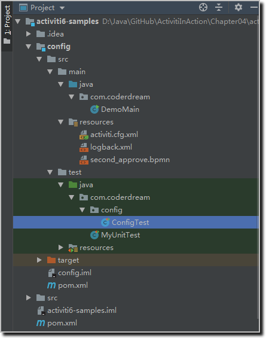
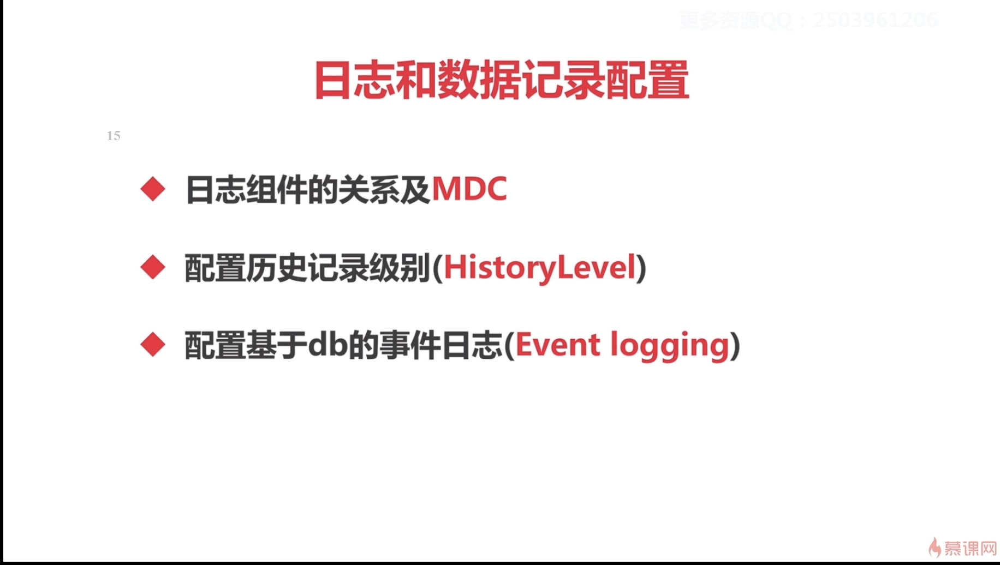
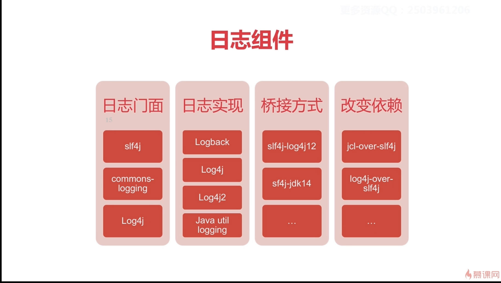
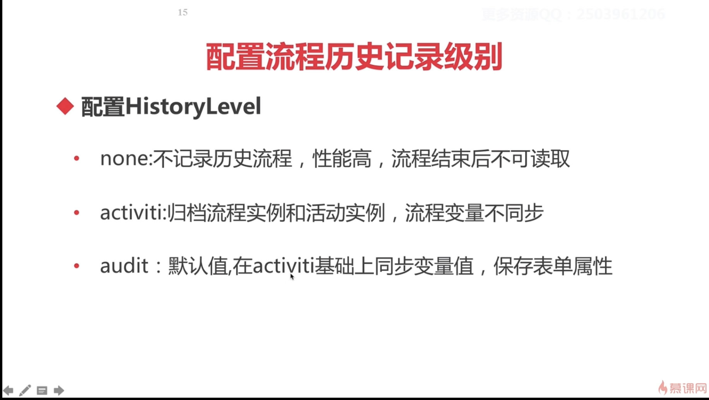
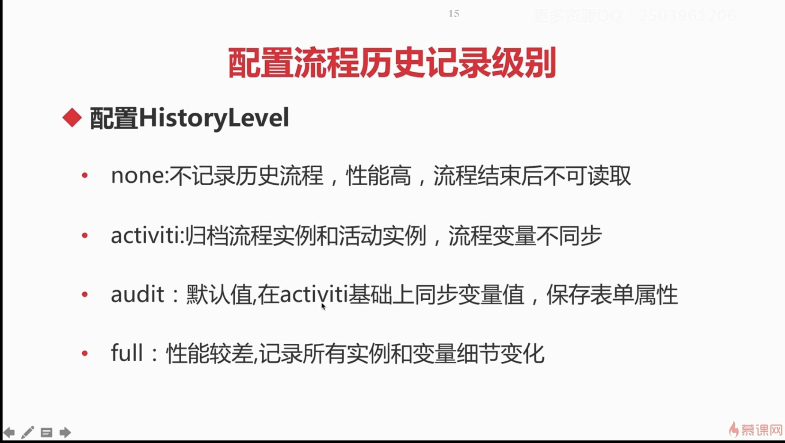

## 第4章 Activiti6.0引擎配置
### 4-1  本章概述
### 4-2  创建流程引擎配置-config_samples

1. 新建Maven空项目activiti-samples
2. 给项目新增Module，名称为config  
3. 新增自定义脚手架  

4. 根据脚手架创建模块  

5. 新建测试文件，路径 activiti6-samples\config\src\test\java\com\coderdream\config，名称 ConfigTest.java：  

- 代码清单：ConfigTest.java
```java
@Test
public void testConfig1() {
    ProcessEngineConfiguration configuration = ProcessEngineConfiguration
            .createProcessEngineConfigurationFromResourceDefault();

    LOGGER.info("configuration = {}", configuration);
}

@Test
public void testConfig2() {
    ProcessEngineConfiguration configuration = ProcessEngineConfiguration
            .createStandaloneProcessEngineConfiguration();

    LOGGER.info("configuration = {}", configuration);
}
```

- 输出结果：
```
configuration = org.activiti.engine.impl.cfg.StandaloneInMemProcessEngineConfiguration@2beee7ff
configuration = org.activiti.engine.impl.cfg.StandaloneProcessEngineConfiguration@366647c2
```
- 流程引擎配置的继承关系                                                                                                                                                                    


### 4-3  创建流程引擎配置-archetype
### 4-4  数据库配置-dbconfig
### 4-5  数据库配置-dbconfig_code

```java
@Test
public void testConfig1() {
    ProcessEngineConfiguration configuration = ProcessEngineConfiguration
            .createProcessEngineConfigurationFromResourceDefault();

    LOGGER.info("configuration = {}", configuration);
    ProcessEngine processEngine = configuration.buildProcessEngine();
    LOGGER.info("获取流程引擎 {}", processEngine.getName());
    processEngine.close();
}
```


```
Loading XML bean definitions from class path resource [activiti.cfg.xml]
configuration = org.activiti.engine.impl.cfg.StandaloneInMemProcessEngineConfiguration@6a6afff2
Activiti 5 compatibility handler implementation not found or error during instantiation : org.activiti.compatibility.DefaultActiviti5CompatibilityHandler. Activiti 5 backwards compatibility disabled.
performing create on engine with resource org/activiti/db/create/activiti.h2.create.engine.sql
performing create on history with resource org/activiti/db/create/activiti.h2.create.history.sql
performing create on identity with resource org/activiti/db/create/activiti.h2.create.identity.sql
ProcessEngine default created
获取流程引擎 default
performing drop on engine with resource org/activiti/db/drop/activiti.h2.drop.engine.sql
performing drop on history with resource org/activiti/db/drop/activiti.h2.drop.history.sql
performing drop on identity with resource org/activiti/db/drop/activiti.h2.drop.identity.sql

Process finished with exit code 0
```


### 4-6  日志记录配置-logging











### 4-7  日志记录配置-logging_mdc


```
15:32:05.953 [main] [ERROR] Error while closing command context ProcessDefinitionId=my-process:1:3     
executionId=5 mdcProcessInstanceId= mdcBusinessKey= o.a.e.i.i.CommandContext.logException:122
java.lang.RuntimeException: only test
	at com.coderdream.delegate.MDCErrorDelegate.execute(MDCErrorDelegate.java:16)
```


### 4-8  历史记录配置-history-1
### 4-9  历史记录配置-history-2
### 4-10  事件处理及监听器配置-eventlog
### 4-11  事件处理及监听器配置-eventLinstener-1
### 4-12  事件处理及监听器配置-eventLinstener-2
### 4-13  命令拦截器配置-command-1
### 4-14  命令拦截器配置-command-2
### 4-15  作业执行器配置-job-1
### 4-16  作业执行器配置-job-2
### 4-17  Activiti与spring集成-1
### 4-18  Activiti与spring集成-2
### 4-19  Activiti与spring集成-3

## 参考网站：

1. [fhqscfss/activiti-test](https://github.com/fhqscfss/activiti-test)
2. [chandler1142/activiti-study](https://github.com/chandler1142/activiti-study)
3. [shengjie8329/activiti-helloword](https://github.com/shengjie8329/activiti-helloword)
4. [DestinyWang/activiti-sample](https://github.com/DestinyWang/activiti-sample)