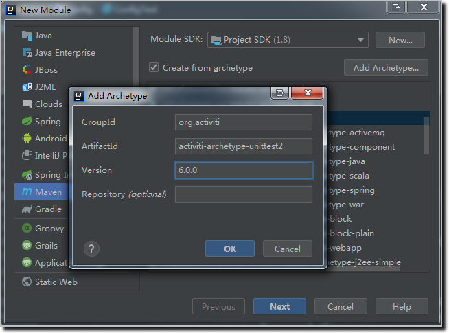
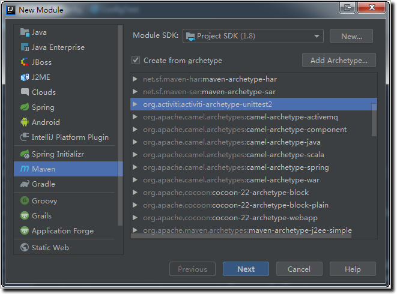

## 第4章 Activiti6.0引擎配置
### 4-1  本章概述
### 4-2  创建流程引擎配置-config_samples


1. 新建Maven空项目activiti-samples
2. 给项目新增Module，名称为config
3. 新增自定义脚手架

4. 根据脚手架创建模块

5. 新建测试文件，路径 activiti6-samples\config\src\test\java\com\coderdream\config，名称 ConfigTest.java：
- 代码清单：ConfigTest.java
```java
@Test
public void testConfig1() {
    ProcessEngineConfiguration configuration = ProcessEngineConfiguration
            .createProcessEngineConfigurationFromResourceDefault();

    LOGGER.info("configuration = {}", configuration);
}

@Test
public void testConfig2() {
    ProcessEngineConfiguration configuration = ProcessEngineConfiguration
            .createStandaloneProcessEngineConfiguration();

    LOGGER.info("configuration = {}", configuration);
}
```

- 输出结果：
```
configuration = org.activiti.engine.impl.cfg.StandaloneInMemProcessEngineConfiguration@2beee7ff
configuration = org.activiti.engine.impl.cfg.StandaloneProcessEngineConfiguration@366647c2
```
- 流程引擎配置的继承关系                                                                                                                                                                    


### 4-3  创建流程引擎配置-archetype
### 4-4  数据库配置-dbconfig
### 4-5  数据库配置-dbconfig_code
### 4-6  日志记录配置-logging
### 4-7  日志记录配置-logging_mdc
### 4-8  历史记录配置-history-1
### 4-9  历史记录配置-history-2
### 4-10  事件处理及监听器配置-eventlog
### 4-11  事件处理及监听器配置-eventLinstener-1
### 4-12  事件处理及监听器配置-eventLinstener-2
### 4-13  命令拦截器配置-command-1
### 4-14  命令拦截器配置-command-2
### 4-15  作业执行器配置-job-1
### 4-16  作业执行器配置-job-2
### 4-17  Activiti与spring集成-1
### 4-18  Activiti与spring集成-2
### 4-19  Activiti与spring集成-3

1. [fhqscfss/activiti-test](https://github.com/fhqscfss/activiti-test)
2. [chandler1142/activiti-study](https://github.com/chandler1142/activiti-study)
3. [shengjie8329/activiti-helloword](https://github.com/shengjie8329/activiti-helloword)